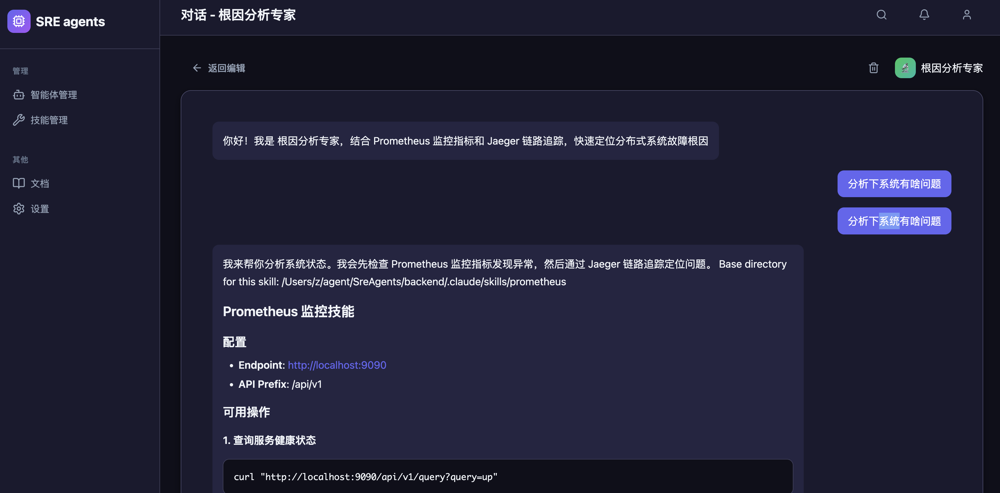
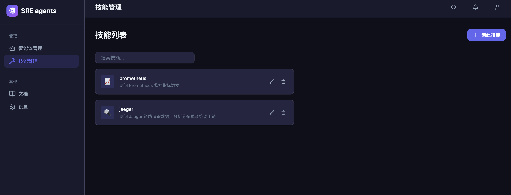

# OpsAgent Platform

智能运维助手平台，基于 Claude Agent SDK 构建。用户可以创建和管理运维智能体（Agent），为其配置技能（Skill），并通过对话方式执行运维任务。

## 功能特性

- 🤖 创建和管理运维智能体
- 🛠️ 灵活配置 Agent 技能（Prometheus 监控、Jaeger 链路追踪等）
- 💬 自然语言对话执行运维任务
- 📊 集成监控和链路追踪数据查询

## 运行截图





## 项目结构

```
.
├── frontend/          # React + Vite 前端
│   ├── src/
│   │   ├── components/   # 组件
│   │   ├── context/      # React Context
│   │   └── pages/        # 页面
│   ├── package.json
│   └── vite.config.js
├── backend/           # Python FastAPI 后端
│   ├── .claude/
│   │   └── skills/       # SDK 原生 Skills (SKILL.md 格式)
│   ├── agents/           # 智能体定义 (Markdown)
│   ├── server.py         # 主服务 (端口 8000)
│   ├── mock_otel.py      # Mock OTel 服务 (端口 9090)
│   └── pyproject.toml
└── start.sh           # 一键启动脚本
```

## 快速开始

### 环境要求

- Node.js 18+
- Python 3.10+ (推荐 3.13)
- uv (Python 包管理器)

### 一键启动

```bash
./start.sh
```

### 分别启动

```bash
# 前端 (端口 5173)
cd frontend && npm run dev

# 后端 (端口 8000)
cd backend && uv run uvicorn server:app --port 8000

# Mock OTel (端口 9090)
cd backend && uv run python mock_otel.py
```

## 开发命令

```bash
# 安装前端依赖
cd frontend && npm install

# 安装后端依赖
cd backend && uv sync

# 前端 lint
cd frontend && npm run lint

# 前端构建
cd frontend && npm run build
```

## 技术栈

- Frontend: React 19 + Vite 7
- Backend: Python FastAPI + Claude Agent SDK
- Mock Services: Prometheus + Jaeger 模拟服务

## License

MIT
